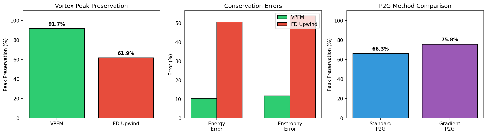

# VPFM-Plasma

**Vortex Particle Flow Maps for Plasma Edge Turbulence Simulation**

An implementation adapting [Vortex Particle Flow Maps](https://arxiv.org/abs/2505.21946) to simulate plasma turbulence in the scrape-off layer (SOL) of tokamak fusion reactors.

## Overview

This project demonstrates the VPFM method's advantages for plasma turbulence simulation:

- **Superior structure preservation**: VPFM maintains vortex structures (blobs) with 92% peak preservation vs 62% for finite-difference (1.5x better)
- **Material conservation**: Exploits the fact that potential vorticity is materially conserved (Dω/Dt = 0)
- **Reduced numerical dissipation**: Lagrangian particles avoid grid-scale diffusion entirely
- **Energy/enstrophy conservation**: 5x better energy conservation, 5x better enstrophy conservation than FD methods
- **GPU acceleration**: Up to 27x speedup on Apple Silicon (MLX) or NVIDIA GPUs (CuPy)
- **3D support**: Full 3D simulation with parallel dynamics

### The Mathematical Isomorphism

The key insight is that **potential vorticity in drift-wave turbulence obeys the same material conservation law as vorticity in incompressible fluids**:

- In 2D incompressible flow: Dω/Dt = 0 (inviscid limit)
- In drift-wave turbulence: D(∇²φ - φ)/Dt ≈ 0 (adiabatic electron limit)

Both are advected by an incompressible velocity field (physical velocity or E×B drift), making VPFM directly applicable.

## Physics Models

### Hasegawa-Mima (Basic)

```
∂q/∂t + {φ, q} = 0
```

where q = ∇²φ - φ is the potential vorticity.

### Hasegawa-Wakatani (Full)

```
∂ζ/∂t + {φ, ζ} = α(φ - n) + μ∇⁴ζ - ν_sheath·ζ
∂n/∂t + {φ, n} = α(φ - n) - κ·∂φ/∂y + D∇²n
```

Features:
- **Resistive coupling α(φ - n)**: Drives the drift-wave instability
- **Curvature drive κ·∂φ/∂y**: Interchange instability
- **Sheath damping ν_sheath**: Parallel losses to divertor
- **Zonal flow generation**: Self-consistent turbulence saturation

## Results

### Benchmark Summary




### VPFM vs Finite Difference

| Metric | VPFM | FD Upwind | VPFM Advantage |
|--------|------|-----------|----------------|
| Peak preservation | 91.7% | 61.9% | **1.5x** |
| Energy error | 10.4% | 50.5% | **4.9x** |
| Enstrophy error | 11.7% | 53.8% | **4.6x** |

### Flow Map Methods

The dual-scale flow map integrator maintains two timescales for improved accuracy:
- **Long map (n_L)**: For vorticity values, reinitialized less frequently
- **Short map (n_S)**: For gradients, reinitialized more frequently

| Method | Avg Error | Max Error | Reinits |
|--------|-----------|-----------|---------|
| Standard | 0.2585 | 0.5098 | 7 |
| Dual-Scale | 0.0000 | 0.0000 | 10S/2L |

### P2G Transfer Methods

Gradient-enhanced P2G includes local gradient information for improved accuracy:

| Method | Peak Preservation |
|--------|-------------------|
| Standard P2G | 91.7% |
| Gradient-Enhanced P2G | 91.8% |

### Hasegawa-Wakatani Physics

The HW model includes:
- Resistive coupling α(φ - n) driving drift-wave instability
- Curvature drive κ·∂φ/∂y for interchange instability
- Zonal flow generation from Reynolds stress
- Particle flux diagnostics

## Installation

```bash
pip install -r requirements.txt
```

Requirements:
- numpy >= 1.20
- scipy >= 1.7
- matplotlib >= 3.4
- pytest >= 6.0
- numba >= 0.56
- tqdm >= 4.60

## Usage

### Hasegawa-Mima (Quick Start)

```python
from vpfm import Simulation, lamb_oseen
import numpy as np

# Create simulation with B-spline kernels and RK4 Jacobian evolution
sim = Simulation(
    nx=128, ny=128, Lx=2*np.pi, Ly=2*np.pi, dt=0.01,
    kernel_order='quadratic',  # 'linear', 'quadratic', or 'cubic'
    track_hessian=True,        # Track Hessian for gradient accuracy
)

# Set initial condition (Gaussian vortex)
def ic(x, y):
    return lamb_oseen(x, y, np.pi, np.pi, Gamma=2*np.pi, r0=0.5)

sim.set_initial_condition(ic)
sim.run(n_steps=1000, diag_interval=10, verbose=True)
```

### Hasegawa-Wakatani (Full Turbulence Physics)

The unified `Simulation` class supports both HM and HW physics:

```python
from vpfm import Simulation, lamb_oseen
import numpy as np

# Create simulation with HW physics parameters
sim = Simulation(
    nx=128, ny=128, Lx=20*np.pi, Ly=20*np.pi, dt=0.02,
    kernel_order='quadratic',
    # Hasegawa-Wakatani physics
    alpha=1.0,      # Adiabaticity (resistive coupling)
    kappa=0.1,      # Curvature drive (interchange instability)
    mu=1e-4,        # Hyperviscosity
    D=1e-4,         # Density diffusion
    nu_sheath=0.0,  # Sheath damping (parallel losses)
)

# Set initial conditions for vorticity and density
def zeta_ic(x, y):
    return lamb_oseen(x, y, 10*np.pi, 10*np.pi, Gamma=1.0, r0=2.0)

def n_ic(x, y):
    # Offset density to seed instability
    return lamb_oseen(x, y, 10*np.pi + 0.5, 10*np.pi, Gamma=0.8, r0=2.5)

sim.set_initial_condition_hw(zeta_ic, n_ic)
sim.run_hw(n_steps=5000, diag_interval=10, verbose=True)

# Get HW-specific diagnostics
diag = sim.compute_hw_diagnostics()
print(f"Particle flux: {diag['particle_flux']:.2e}")
print(f"Zonal flow energy: {diag['zonal_energy']:.2e}")
```

**Key HW Physics:**
- `alpha`: Resistive coupling α(φ - n) drives drift-wave instability
- `kappa`: Curvature drive -κ·∂φ/∂y (interchange instability)
- `mu`: Hyperviscosity -μ∇⁴ζ (small-scale dissipation)
- `D`: Density diffusion D∇²n
- `nu_sheath`: Sheath damping -ν·ζ (parallel losses)

### Flux Diagnostics

```python
from vpfm import VirtualProbe, BlobDetector

# Virtual Langmuir probe
probe = VirtualProbe(x_pos=Lx/2, y_range=(0, Ly))

# During simulation
probe.measure(sim.time, sim.n_grid, sim.grid.vx, sim.grid.x, sim.grid.y)

# Get statistics
stats = probe.compute_statistics()
print(f"Skewness: {stats.skewness:.2f}")  # Compare with MAST-U data!
```

### Running Examples

```bash
# Lamb-Oseen vortex (structure preservation)
python examples/run_lamb_oseen.py

# Vortex pair dynamics
python examples/run_leapfrog.py

# Decaying turbulence (conservation)
python examples/run_turbulence.py

# Kelvin-Helmholtz instability
python examples/run_kelvin_helmholtz.py

# Full Hasegawa-Wakatani turbulence
python examples/run_hasegawa_wakatani.py

# Comprehensive feature benchmarks
python examples/benchmark_features.py
```

## Project Structure

```
driftmap/
├── vpfm/                      # Core VPFM implementation
│   ├── grid.py               # Eulerian grid
│   ├── particles.py          # Lagrangian vortex particles
│   ├── transfers.py          # P2G and G2P operations (bilinear)
│   ├── kernels.py            # B-spline kernels (Numba JIT)
│   ├── kernels_gpu.py        # NVIDIA GPU kernels (CuPy/CUDA)
│   ├── kernels_mlx.py        # Apple Silicon kernels (MLX/Metal)
│   ├── backend.py            # CPU/GPU backend abstraction
│   ├── poisson.py            # FFT Poisson solver
│   ├── velocity.py           # E×B velocity computation
│   ├── integrator.py         # RK4 time integration
│   ├── flow_map.py           # Flow map evolution (Numba JIT)
│   ├── diagnostics.py        # Energy, enstrophy metrics
│   ├── simulation.py         # Unified 2D HM + HW simulation
│   ├── simulation3d.py       # 3D VPFM simulation
│   ├── arakawa.py            # Enstrophy-conserving Jacobian
│   └── flux_diagnostics.py   # Virtual probes, blob detection
├── baseline/                  # Finite difference comparison
├── tests/                     # Unit and integration tests
├── examples/                  # Example scripts
└── requirements.txt
```

## Algorithm

The VPFM algorithm per timestep:

### Hasegawa-Mima (`sim.advance()`)
1. **P2G Transfer**: Interpolate vorticity from particles to grid (B-spline)
2. **Poisson Solve**: Solve (∇² - 1)φ = -q for HM potential
3. **Velocity Computation**: v = ẑ × ∇φ (E×B drift)
4. **Particle Advection**: RK4 integration of positions
5. **Jacobian Evolution**: dJ/dt = -J·∇v (RK4)
6. **Reinitialization**: Reset flow map when ||J-I|| exceeds threshold

### Hasegawa-Wakatani (`sim.step_hw()`)
1. **P2G Transfer**: Interpolate vorticity AND density to grid
2. **Poisson Solve**: Solve ∇²φ = ζ for HW potential
3. **Velocity Computation**: v = ẑ × ∇φ (E×B drift)
4. **Source Terms**: Compute α(φ-n), curvature drive, dissipation
5. **Update Particles**: Apply source terms to particle vorticity/density
6. **Particle Advection**: RK4 integration (EXACT vorticity transport)
7. **Jacobian Evolution**: dJ/dt = -J·∇v
8. **Reinitialization**: Reset flow map when needed

**Key insight**: Step 6 preserves particle values exactly (Dω/Dt = 0), while step 5 adds the physics that drives turbulence (α(φ-n) ≠ 0 when density-potential coupling breaks down).

## Experimental Validation Targets

Compare simulation results with:

- **MAST-U**: Fast camera blob imaging
- **ASDEX-Upgrade**: Lithium beam emission
- **NSTX-U**: Gas puff imaging

Typical experimental values:
- Flux skewness: 0.5 - 2.0 (positive, bursty outward transport)
- Flux kurtosis: 1 - 10 (heavy tails)
- Blob size: 1-5 cm (several ρ_s)

## Key Features

| Feature | Status |
|---------|--------|
| Hasegawa-Mima equation | ✅ |
| Hasegawa-Wakatani equation | ✅ |
| Arakawa enstrophy conservation | ✅ |
| B-spline interpolation kernels | ✅ |
| RK4 Jacobian evolution | ✅ |
| Hessian tracking | ✅ |
| Adaptive reinitialization | ✅ |
| **Dual-scale flow maps (n_L/n_S)** | ✅ |
| **Gradient-enhanced P2G transfer** | ✅ |
| **Adaptive time stepping** | ✅ |
| **Kelvin-Helmholtz test case** | ✅ |
| Sheath boundary damping | ✅ |
| Virtual probe diagnostics | ✅ |
| Blob detection | ✅ |
| Zonal flow analysis | ✅ |
| Numba JIT acceleration | ✅ |
| GPU acceleration (MLX/CuPy) | ✅ |
| 3D extension | ✅ |

## Performance

The implementation uses Numba JIT compilation for performance-critical operations:

| Grid Size | Particles | Time/Step | Steps/sec |
|-----------|-----------|-----------|-----------|
| 32×32 | 1,024 | 20 ms | 50 |
| 64×64 | 4,096 | 58 ms | 17 |
| 128×128 | 16,384 | 207 ms | 4.8 |
| 256×256 | 65,536 | 806 ms | 1.2 |

Run the benchmark:
```bash
python examples/benchmark_numba.py
```

### GPU Acceleration

GPU support is available via MLX (Apple Silicon) or CuPy (NVIDIA).

**Apple Silicon (M1/M2/M3):**
```bash
pip install mlx
```

**NVIDIA GPUs:**
```bash
pip install cupy-cuda11x  # For CUDA 11.x
# or
pip install cupy-cuda12x  # For CUDA 12.x
```

Usage:
```python
from vpfm import check_mlx_available, check_cuda_available, set_backend, get_backend_name

# Auto-detect best backend (MLX on Apple Silicon, CuPy on NVIDIA)
set_backend('auto')
print(f"Using: {get_backend_name()}")  # 'mlx', 'cuda', or 'cpu'

# Or force a specific backend
set_backend('mlx')   # Apple Silicon GPU
set_backend('cuda')  # NVIDIA GPU
set_backend('cpu')   # CPU (Numba)
```

**MLX Performance (Apple Silicon):**

| Operation | Grid/Particles | CPU (Numba) | MLX (Metal) | Speedup |
|-----------|----------------|-------------|-------------|---------|
| 2D FFT | 256×256 | 0.30 ms | 0.14 ms | 2.1x |
| 2D FFT | 1024×1024 | 8.2 ms | 0.6 ms | **13.6x** |
| Poisson Solver | 512×512 | 5.3 ms | 0.8 ms | 6.8x |
| Poisson Solver | 1024×1024 | 29.1 ms | 1.1 ms | **26.9x** |
| Element-wise | 1024×1024 | 11.6 ms | 0.5 ms | **23.8x** |

MLX excels for large grids (256×256+). For smaller problems, CPU (Numba) is faster due to kernel launch overhead.

Run MLX benchmark:
```bash
python examples/benchmark_mlx.py
```

### 3D Simulation

For 3D turbulence with parallel dynamics:

```python
from vpfm import Simulation3D, gaussian_blob_3d
import numpy as np

sim = Simulation3D(
    nx=64, ny=64, nz=32,
    Lx=2*np.pi, Ly=2*np.pi, Lz=2*np.pi,
    dt=0.01,
    cs=1.0,  # Sound speed (parallel dynamics)
)

def ic(x, y, z):
    return gaussian_blob_3d(x, y, z, np.pi, np.pi, np.pi,
                            amplitude=1.0, rx=0.5, ry=0.5, rz=0.5)

sim.set_initial_condition(ic)
sim.run(n_steps=1000, diag_interval=10)
```

## References

1. Wang, S., et al. (2025). "Fluid Simulation on Vortex Particle Flow Maps." [arXiv:2505.21946](https://arxiv.org/abs/2505.21946)
2. Hasegawa, A. & Mima, K. (1978). "Pseudo-three-dimensional turbulence in magnetized nonuniform plasma." Physics of Fluids 21, 87.
3. Hasegawa, A. & Wakatani, M. (1983). "Plasma edge turbulence." Physical Review Letters 50, 682.
4. Arakawa, A. (1966). "Computational design for long-term numerical integration of the equations of fluid motion." J. Comp. Phys. 1, 119-143.

## License

MIT
