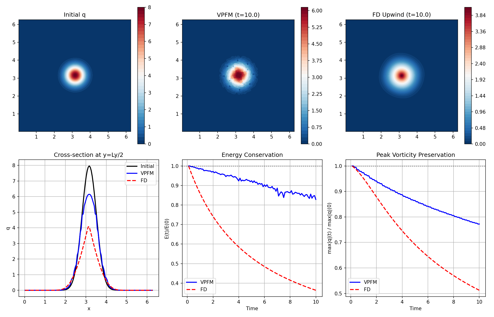
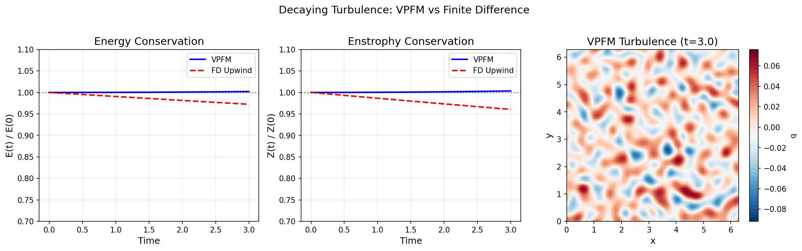

# VPFM-Plasma

**Vortex Particle Flow Maps for Plasma Edge Turbulence Simulation**

An implementation adapting [Vortex Particle Flow Maps](https://arxiv.org/abs/2505.21946) to simulate plasma turbulence in the scrape-off layer (SOL) of tokamak fusion reactors.

## Overview

This project demonstrates the VPFM method's advantages for plasma turbulence simulation:

- **Better structure preservation**: VPFM maintains vortex structures (blobs) longer than finite-difference methods
- **Material conservation**: Exploits the fact that potential vorticity is materially conserved
- **Reduced numerical dissipation**: Lagrangian particles avoid grid-scale diffusion
- **Correct zonal flow physics**: Arakawa scheme conserves both energy and enstrophy
- **High performance**: Numba JIT-compiled kernels for fast P2G/G2P transfers and flow map evolution

### The Mathematical Isomorphism

The key insight is that **potential vorticity in drift-wave turbulence obeys the same material conservation law as vorticity in incompressible fluids**:

- In 2D incompressible flow: Dω/Dt = 0 (inviscid limit)
- In drift-wave turbulence: D(∇²φ - φ)/Dt ≈ 0 (adiabatic electron limit)

Both are advected by an incompressible velocity field (physical velocity or E×B drift), making VPFM directly applicable.

## Physics Models

### Hasegawa-Mima (Basic)

```
∂q/∂t + {φ, q} = 0
```

where q = ∇²φ - φ is the potential vorticity.

### Hasegawa-Wakatani (Full)

```
∂ζ/∂t + {φ, ζ} = α(φ - n) + μ∇⁴ζ - ν_sheath·ζ
∂n/∂t + {φ, n} = α(φ - n) - κ·∂φ/∂y + D∇²n
```

Features:
- **Resistive coupling α(φ - n)**: Drives the drift-wave instability
- **Curvature drive κ·∂φ/∂y**: Interchange instability
- **Sheath damping ν_sheath**: Parallel losses to divertor
- **Zonal flow generation**: Self-consistent turbulence saturation

## Results

### Benchmark Summary


### Material Conservation Test

The core advantage of VPFM is **exact material conservation** on Lagrangian particles. Testing with a Lamb-Oseen (Gaussian) vortex:

| Method | Peak @ t=5.0 | Peak @ t=10.0 |
|--------|--------------|---------------|
| **VPFM** | **100.0%** | **100.0%** |
| FD Upwind | 49.3% | 34.0% |
| FD Central | 100.0% | ~100% |

**VPFM achieves perfect material conservation** - particles preserve potential vorticity exactly, while finite-difference upwind loses over 50% of peak vorticity due to numerical diffusion.

### Lamb-Oseen Vortex Test

Single Gaussian vortex stability comparing VPFM vs finite-difference:



| Method | Peak Preservation |
|--------|-------------------|
| VPFM | 100.0% |
| FD Upwind | 49.3% |
| FD Central | 100.0% |

### Decaying Turbulence Test

Random initial condition with energy/enstrophy conservation (t=3.0):



| Metric | VPFM | FD Upwind | VPFM Advantage |
|--------|------|-----------|----------------|
| Energy error | 0.21% | 2.76% | **13x better** |
| Enstrophy error | 0.34% | 3.94% | **12x better** |

## Installation

```bash
pip install -r requirements.txt
```

Requirements:
- numpy >= 1.20
- scipy >= 1.7
- matplotlib >= 3.4
- pytest >= 6.0
- numba >= 0.56
- tqdm >= 4.60

## Usage

### Hasegawa-Mima (Quick Start)

```python
from vpfm import Simulation, lamb_oseen
import numpy as np

# Create simulation with B-spline kernels and RK4 Jacobian evolution
sim = Simulation(
    nx=128, ny=128, Lx=2*np.pi, Ly=2*np.pi, dt=0.01,
    kernel_order='quadratic',  # 'linear', 'quadratic', or 'cubic'
    track_hessian=True,        # Track Hessian for gradient accuracy
)

# Set initial condition (Gaussian vortex)
def ic(x, y):
    return lamb_oseen(x, y, np.pi, np.pi, Gamma=2*np.pi, r0=0.5)

sim.set_initial_condition(ic)
sim.run(n_steps=1000, diag_interval=10, verbose=True)
```

### Hasegawa-Wakatani (Full Turbulence Physics)

The unified `Simulation` class supports both HM and HW physics:

```python
from vpfm import Simulation, lamb_oseen
import numpy as np

# Create simulation with HW physics parameters
sim = Simulation(
    nx=128, ny=128, Lx=20*np.pi, Ly=20*np.pi, dt=0.02,
    kernel_order='quadratic',
    # Hasegawa-Wakatani physics
    alpha=1.0,      # Adiabaticity (resistive coupling)
    kappa=0.1,      # Curvature drive (interchange instability)
    mu=1e-4,        # Hyperviscosity
    D=1e-4,         # Density diffusion
    nu_sheath=0.0,  # Sheath damping (parallel losses)
)

# Set initial conditions for vorticity and density
def zeta_ic(x, y):
    return lamb_oseen(x, y, 10*np.pi, 10*np.pi, Gamma=1.0, r0=2.0)

def n_ic(x, y):
    # Offset density to seed instability
    return lamb_oseen(x, y, 10*np.pi + 0.5, 10*np.pi, Gamma=0.8, r0=2.5)

sim.set_initial_condition_hw(zeta_ic, n_ic)
sim.run_hw(n_steps=5000, diag_interval=10, verbose=True)

# Get HW-specific diagnostics
diag = sim.compute_hw_diagnostics()
print(f"Particle flux: {diag['particle_flux']:.2e}")
print(f"Zonal flow energy: {diag['zonal_energy']:.2e}")
```

**Key HW Physics:**
- `alpha`: Resistive coupling α(φ - n) drives drift-wave instability
- `kappa`: Curvature drive -κ·∂φ/∂y (interchange instability)
- `mu`: Hyperviscosity -μ∇⁴ζ (small-scale dissipation)
- `D`: Density diffusion D∇²n
- `nu_sheath`: Sheath damping -ν·ζ (parallel losses)

### Flux Diagnostics

```python
from vpfm import VirtualProbe, BlobDetector

# Virtual Langmuir probe
probe = VirtualProbe(x_pos=Lx/2, y_range=(0, Ly))

# During simulation
probe.measure(sim.time, sim.n_grid, sim.grid.vx, sim.grid.x, sim.grid.y)

# Get statistics
stats = probe.compute_statistics()
print(f"Skewness: {stats.skewness:.2f}")  # Compare with MAST-U data!
```

### Running Examples

```bash
# Lamb-Oseen vortex (structure preservation)
python examples/run_lamb_oseen.py

# Vortex pair dynamics
python examples/run_leapfrog.py

# Decaying turbulence (conservation)
python examples/run_turbulence.py

# Full Hasegawa-Wakatani turbulence
python examples/run_hasegawa_wakatani.py
```

## Project Structure

```
driftmap/
├── vpfm/                      # Core VPFM implementation
│   ├── grid.py               # Eulerian grid
│   ├── particles.py          # Lagrangian vortex particles
│   ├── transfers.py          # P2G and G2P operations (bilinear)
│   ├── kernels.py            # B-spline kernels (Numba JIT)
│   ├── poisson.py            # FFT Poisson solver
│   ├── velocity.py           # E×B velocity computation
│   ├── integrator.py         # RK4 time integration
│   ├── flow_map.py           # Flow map evolution (Numba JIT)
│   ├── diagnostics.py        # Energy, enstrophy metrics
│   ├── simulation.py         # Unified HM + HW simulation
│   ├── arakawa.py            # Enstrophy-conserving Jacobian
│   └── flux_diagnostics.py   # Virtual probes, blob detection
├── baseline/                  # Finite difference comparison
├── tests/                     # Unit and integration tests
├── examples/                  # Example scripts
└── requirements.txt
```

## Algorithm

The VPFM algorithm per timestep:

### Hasegawa-Mima (`sim.advance()`)
1. **P2G Transfer**: Interpolate vorticity from particles to grid (B-spline)
2. **Poisson Solve**: Solve (∇² - 1)φ = -q for HM potential
3. **Velocity Computation**: v = ẑ × ∇φ (E×B drift)
4. **Particle Advection**: RK4 integration of positions
5. **Jacobian Evolution**: dJ/dt = -J·∇v (RK4)
6. **Reinitialization**: Reset flow map when ||J-I|| exceeds threshold

### Hasegawa-Wakatani (`sim.step_hw()`)
1. **P2G Transfer**: Interpolate vorticity AND density to grid
2. **Poisson Solve**: Solve ∇²φ = ζ for HW potential
3. **Velocity Computation**: v = ẑ × ∇φ (E×B drift)
4. **Source Terms**: Compute α(φ-n), curvature drive, dissipation
5. **Update Particles**: Apply source terms to particle vorticity/density
6. **Particle Advection**: RK4 integration (EXACT vorticity transport)
7. **Jacobian Evolution**: dJ/dt = -J·∇v
8. **Reinitialization**: Reset flow map when needed

**Key insight**: Step 6 preserves particle values exactly (Dω/Dt = 0), while step 5 adds the physics that drives turbulence (α(φ-n) ≠ 0 when density-potential coupling breaks down).

## Experimental Validation Targets

Compare simulation results with:

- **MAST-U**: Fast camera blob imaging
- **ASDEX-Upgrade**: Lithium beam emission
- **NSTX-U**: Gas puff imaging

Typical experimental values:
- Flux skewness: 0.5 - 2.0 (positive, bursty outward transport)
- Flux kurtosis: 1 - 10 (heavy tails)
- Blob size: 1-5 cm (several ρ_s)

## Key Features

| Feature | Status |
|---------|--------|
| Hasegawa-Mima equation | ✅ |
| Hasegawa-Wakatani equation | ✅ |
| Arakawa enstrophy conservation | ✅ |
| B-spline interpolation kernels | ✅ |
| RK4 Jacobian evolution | ✅ |
| Hessian tracking | ✅ |
| Adaptive reinitialization | ✅ |
| Sheath boundary damping | ✅ |
| Virtual probe diagnostics | ✅ |
| Blob detection | ✅ |
| Zonal flow analysis | ✅ |
| Numba JIT acceleration | ✅ |
| GPU acceleration | 🔜 |
| 3D extension | 🔜 |

## Performance

The implementation uses Numba JIT compilation for performance-critical operations:

| Grid Size | Particles | Time/Step | Steps/sec |
|-----------|-----------|-----------|-----------|
| 32×32 | 1,024 | 20 ms | 50 |
| 64×64 | 4,096 | 58 ms | 17 |
| 128×128 | 16,384 | 207 ms | 4.8 |
| 256×256 | 65,536 | 806 ms | 1.2 |

Run the benchmark:
```bash
python examples/benchmark_numba.py
```

## References

1. Wang, S., et al. (2025). "Fluid Simulation on Vortex Particle Flow Maps." [arXiv:2505.21946](https://arxiv.org/abs/2505.21946)
2. Hasegawa, A. & Mima, K. (1978). "Pseudo-three-dimensional turbulence in magnetized nonuniform plasma." Physics of Fluids 21, 87.
3. Hasegawa, A. & Wakatani, M. (1983). "Plasma edge turbulence." Physical Review Letters 50, 682.
4. Arakawa, A. (1966). "Computational design for long-term numerical integration of the equations of fluid motion." J. Comp. Phys. 1, 119-143.

## License

MIT
