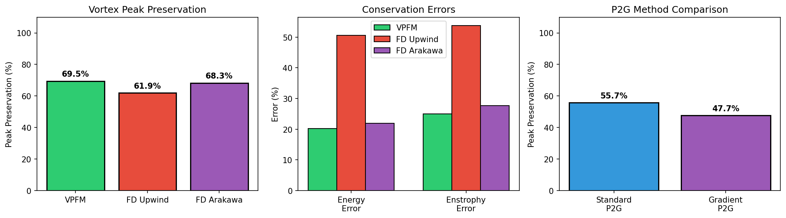

# Driftmap (VPFM-Plasma)

**Vortex Particle Flow Maps for Plasma Edge Turbulence Simulation**

Driftmap adapts [Vortex Particle Flow Maps](https://arxiv.org/abs/2505.21946) to simulate plasma turbulence in the scrape-off layer (SOL) of tokamak fusion reactors.
The Python package name is `vpfm` to keep the VPFM terminology intact.

## Overview

A Lagrangian vortex method for 2D drift-wave turbulence, adapting VPFM to plasma physics:

- **Material conservation**: Potential vorticity is materially conserved in HM; HW adds explicit source terms
- **Lagrangian advection**: Particles carry vorticity/density; velocity reconstructed on Eulerian grid
- **Validated physics**: Linear HW dispersion test in `tests/linear_validation/test_dispersion.py`
- **Arakawa baseline comparison**: Matches Arakawa FD accuracy for energy/enstrophy conservation

### The Mathematical Isomorphism

The key insight is that **potential vorticity in drift-wave turbulence obeys the same material conservation law as vorticity in incompressible fluids**:

- In 2D incompressible flow: Dω/Dt = 0 (inviscid limit)
- In drift-wave turbulence: D(∇²φ - φ)/Dt ≈ 0 (adiabatic electron limit)

Both are advected by an incompressible velocity field (physical velocity or E×B drift), making VPFM directly applicable.

## Physics Models

### Hasegawa-Mima (Basic)

```
∂q/∂t + {φ, q} = 0
```

where q = ∇²φ - φ is the potential vorticity.

### Hasegawa-Wakatani (Full)

```
∂ζ/∂t + {φ, ζ} = α(φ - n) - ν∇²ζ - μ∇⁴ζ - ν_sheath·ζ
∂n/∂t + {φ, n} = α(φ - n) - κ·∂φ/∂y + D∇²n
```

Features:
- **Resistive coupling α(φ - n)**: Drives the drift-wave instability
- **Curvature drive κ·∂φ/∂y**: Interchange instability
- **Viscosity ν∇²ζ**: Large-scale damping
- **Sheath damping ν_sheath**: Parallel losses to divertor
- **Zonal flow generation**: Self-consistent turbulence saturation

## Results

### Benchmark Summary




### VPFM vs Arakawa Finite Difference

VPFM achieves comparable accuracy to Arakawa finite-differences for Hasegawa-Wakatani turbulence.
Numbers from `examples/benchmark_features.py`:

| Metric | VPFM | Arakawa FD |
|--------|------|------------|
| Peak preservation | 69.5% | 68.3% |
| Energy error | 20.2% | 22.0% |
| Enstrophy error | 25.0% | 27.6% |

The Lagrangian method achieves comparable accuracy while offering a fundamentally different numerical structure, providing a foundation for future extensions where Lagrangian properties may be advantageous (long-time integration, Lagrangian diagnostics, particle tracking).

### Hasegawa-Wakatani Physics

The HW model includes:
- Resistive coupling α(φ - n) driving drift-wave instability
- Curvature drive κ·∂φ/∂y for interchange instability
- Modified HW option (remove ky=0 coupling) via `modified_hw=True`
- Linear HW mode for dispersion tests via `linear_hw=True`
- Zonal flow generation from Reynolds stress
- Particle flux diagnostics

Density is carried on particles and transferred to the grid each step for coupling and diagnostics.

### Caveats

- Benchmarks compare against Arakawa FD baseline (uses smaller dt and mild viscosity for stability)
- HW source terms are explicit; high α requires smaller dt or an IMEX scheme (not yet implemented)
- Reinitialization thresholds and particle density affect diffusion; tune for long-time accuracy
- Experimental features (dual-scale flow maps, gradient-enhanced P2G, 3D) are documented at the end of this README

## Installation

```bash
pip install -r requirements.txt
```

Requirements:
- numpy >= 1.20
- scipy >= 1.7
- matplotlib >= 3.4
- pytest >= 6.0
- numba >= 0.56
- tqdm >= 4.60

## Usage

### Hasegawa-Mima (Quick Start)

```python
from vpfm import Simulation, lamb_oseen
import numpy as np

# Create simulation with B-spline kernels and RK4 Jacobian evolution
sim = Simulation(
    nx=128, ny=128, Lx=2*np.pi, Ly=2*np.pi, dt=0.01,
    kernel_order='quadratic',  # 'linear', 'quadratic', or 'cubic'
    track_hessian=True,        # Track Hessian for gradient accuracy
    backend='cpu',             # or 'mlx' for quadratic-kernel MLX acceleration
)

# Set initial condition (Gaussian vortex)
def ic(x, y):
    return lamb_oseen(x, y, np.pi, np.pi, Gamma=2*np.pi, r0=0.5)

sim.set_initial_condition(ic)
sim.run(n_steps=1000, diag_interval=10, verbose=True)
```

### Hasegawa-Wakatani (Full Turbulence Physics)

The unified `Simulation` class supports both HM and HW physics:

```python
from vpfm import Simulation, lamb_oseen
import numpy as np

# Create simulation with HW physics parameters
sim = Simulation(
    nx=128, ny=128, Lx=20*np.pi, Ly=20*np.pi, dt=0.02,
    kernel_order='quadratic',
    # Hasegawa-Wakatani physics
    alpha=1.0,      # Adiabaticity (resistive coupling)
    kappa=0.1,      # Curvature drive (interchange instability)
    mu=1e-4,        # Hyperviscosity
    D=1e-4,         # Density diffusion
    nu_sheath=0.0,  # Sheath damping (parallel losses)
    backend='cpu',  # or 'mlx' for quadratic-kernel MLX acceleration
)

# Set initial conditions for vorticity and density
def zeta_ic(x, y):
    return lamb_oseen(x, y, 10*np.pi, 10*np.pi, Gamma=1.0, r0=2.0)

def n_ic(x, y):
    # Offset density to seed instability
    return lamb_oseen(x, y, 10*np.pi + 0.5, 10*np.pi, Gamma=0.8, r0=2.5)

sim.set_initial_condition_hw(zeta_ic, n_ic)
sim.run_hw(n_steps=5000, diag_interval=10, verbose=True)

# Get HW-specific diagnostics
diag = sim.compute_hw_diagnostics()
print(f"Particle flux: {diag['particle_flux']:.2e}")
print(f"Zonal flow energy: {diag['zonal_energy']:.2e}")
```

**Key HW Physics:**
- `alpha`: Resistive coupling α(φ - n) drives drift-wave instability
- `kappa`: Curvature drive -κ·∂φ/∂y (interchange instability)
- `nu`: Viscosity -ν∇²ζ (large-scale damping)
- `mu`: Hyperviscosity -μ∇⁴ζ (small-scale dissipation)
- `D`: Density diffusion D∇²n
- `nu_sheath`: Sheath damping -ν·ζ (parallel losses)
- `modified_hw`: Remove ky=0 coupling for modified HW (zonal-flow friendly)
- `linear_hw`: Disable advection/flow-map updates for linear tests

### Flux Diagnostics

```python
from vpfm import VirtualProbe, BlobDetector

# Virtual Langmuir probe
probe = VirtualProbe(x_pos=Lx/2, y_range=(0, Ly))

# During simulation
probe.measure(sim.time, sim.n_grid, sim.grid.vx, sim.grid.x, sim.grid.y)

# Get statistics
stats = probe.compute_statistics()
print(f"Skewness: {stats.skewness:.2f}")
```

### Running Examples

```bash
# Lamb-Oseen vortex (structure preservation)
python examples/run_lamb_oseen.py

# Vortex pair dynamics
python examples/run_leapfrog.py

# Decaying turbulence (conservation)
python examples/run_turbulence.py

# Kelvin-Helmholtz instability
python examples/run_kelvin_helmholtz.py

# Full Hasegawa-Wakatani turbulence
python examples/run_hasegawa_wakatani.py

# Comprehensive feature benchmarks
python examples/benchmark_features.py
```

## Project Structure

```
driftmap/
├── assets/
│   └── images/               # Saved plots and benchmarks
├── src/
│   └── vpfm/
│       ├── backends/         # Optional GPU/MLX kernels + backend helpers
│       ├── core/             # Grid, particles, kernels, flow map
│       ├── diagnostics/      # Energy, enstrophy, probes, blob detection
│       ├── numerics/         # Poisson and velocity operators
│       └── physics/          # HM/HW simulations, 3D extension, IC utilities
├── baseline/                  # Finite difference comparison
├── tests/                     # Unit and integration tests
│   ├── linear_validation/     # HW dispersion checks
│   └── kadoch_benchmark/      # Spectral benchmarks + blob preservation
├── examples/                  # Example scripts
├── README.md
└── requirements.txt
```

## Algorithm

The VPFM algorithm per timestep:

### Hasegawa-Mima (`sim.advance()`)
1. **P2G Transfer**: Interpolate vorticity from particles to grid (B-spline)
2. **Poisson Solve**: Solve (∇² - 1)φ = -q for HM potential
3. **Velocity Computation**: v = ẑ × ∇φ (E×B drift)
4. **Particle Advection**: RK4 integration of positions
5. **Jacobian Evolution**: dJ/dt = -J·∇v (RK4)
6. **Reinitialization**: Reset flow map when ||J-I|| exceeds threshold

### Hasegawa-Wakatani (`sim.step_hw()`)
1. **P2G Transfer**: Interpolate vorticity AND density to grid
2. **Poisson Solve**: Solve ∇²φ = ζ for HW potential (zero-mean φ for periodic domain)
3. **Velocity Computation**: v = ẑ × ∇φ (E×B drift)
4. **Source Terms**: Compute α(φ-n), curvature drive, dissipation
5. **Update Particles**: Apply source terms to particle vorticity/density
6. **Particle Advection**: RK4 integration (EXACT vorticity transport)
7. **Jacobian Evolution**: dJ/dt = -J·∇v
8. **Reinitialization**: Reset flow map when needed

**Key insight**: Step 6 preserves particle values exactly (Dω/Dt = 0), while step 5 adds the physics that drives turbulence (α(φ-n) ≠ 0 when density-potential coupling breaks down).

## Validation

Quick checks and benchmark scaffolding:

```bash
# Linear dispersion (HW)
pytest tests/linear_validation/test_dispersion.py

# Kadoch spectral benchmark (fast smoke test)
python tests/kadoch_benchmark/run_benchmark.py --fast

# Blob peak preservation vs FD baseline
python tests/kadoch_benchmark/blob_preservation.py
```

## Key Features

| Feature | Status |
|---------|--------|
| Hasegawa-Mima equation | ✅ |
| Hasegawa-Wakatani equation | ✅ |
| Linear HW dispersion validation | ✅ |
| Arakawa FD baseline comparison | ✅ |
| B-spline interpolation kernels | ✅ |
| RK4 Jacobian evolution | ✅ |
| Hessian tracking | ✅ |
| Adaptive reinitialization | ✅ |
| Sheath damping term (ν_sheath) | ✅ |
| Virtual probe diagnostics | ✅ |
| Blob detection | ✅ |
| Zonal flow analysis | ✅ |
| Numba JIT acceleration | ✅ |

See [Experimental Features](#experimental-features) for: dual-scale flow maps, gradient-enhanced P2G, 3D extension, GPU backends.

## Performance

The implementation uses Numba JIT compilation for performance-critical operations.
Timings below are CPU end-to-end timesteps:

| Grid Size | Particles | Time/Step | Steps/sec |
|-----------|-----------|-----------|-----------|
| 32×32 | 1,024 | 19.24 ms | 52.0 |
| 64×64 | 4,096 | 44.31 ms | 22.6 |
| 128×128 | 16,384 | 144.19 ms | 6.9 |
| 256×256 | 65,536 | 539.49 ms | 1.9 |

Run the benchmark:
```bash
python examples/benchmark_numba.py
```

## References

1. Wang, S., et al. (2025). "Fluid Simulation on Vortex Particle Flow Maps." [arXiv:2505.21946](https://arxiv.org/abs/2505.21946)
2. Hasegawa, A. & Mima, K. (1978). "Pseudo-three-dimensional turbulence in magnetized nonuniform plasma." Physics of Fluids 21, 87.
3. Hasegawa, A. & Wakatani, M. (1983). "Plasma edge turbulence." Physical Review Letters 50, 682.
4. Arakawa, A. (1966). "Computational design for long-term numerical integration of the equations of fluid motion." J. Comp. Phys. 1, 119-143.
5. Kadoch, B., et al. (2022). "Lagrangian conditional statistics and flow topology in edge plasma turbulence." Physics of Plasmas 29, 102301.

## Experimental Features

These features are included but not yet fully validated. Use with caution and expect to tune parameters.

### Dual-Scale Flow Maps

Maintains two timescales for potentially improved gradient accuracy. Currently shows higher errors than standard method in benchmarks:

```python
sim = Simulation(
    nx=128, ny=128, Lx=2*np.pi, Ly=2*np.pi, dt=0.01,
    use_dual_scale=True,
    dual_scale_nL=100,
    dual_scale_nS=20,
)
```

| Method | Avg Error | Max Error |
|--------|-----------|-----------|
| Standard | 0.30 | 0.54 |
| Dual-Scale | 1.81 | 2.83 |

### Gradient-Enhanced P2G

Includes local gradient information in particle-to-grid transfer. Currently shows lower peak preservation:

| Method | Peak Preservation |
|--------|-------------------|
| Standard P2G | 55.7% |
| Gradient-Enhanced P2G | 47.7% |

### 3D Extension

3D VPFM with simple parallel dynamics. Not validated against standard 3D drift-wave benchmarks:

```python
from vpfm import Simulation3D, gaussian_blob_3d
import numpy as np

sim = Simulation3D(
    nx=64, ny=64, nz=32,
    Lx=2*np.pi, Ly=2*np.pi, Lz=2*np.pi,
    dt=0.01,
    cs=1.0,  # Sound speed (parallel dynamics)
)
```

### GPU Backends

- **MLX (Apple Silicon)**: Accelerates Poisson/velocity, quadratic P2G/G2P, flow-map updates. Non-quadratic kernels fall back to CPU.
- **CuPy (NVIDIA)**: Standalone kernels only, not wired into full timestep.

MLX helps most for FFT-heavy steps at larger grids (256×256+). For P2G/G2P and Jacobian updates, the CPU path is often faster due to scatter/gather overhead.

## License

MIT
